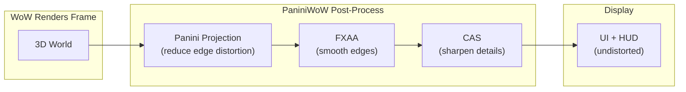

[](https://github.com/mannie-exe/panini-classic-wow/actions/workflows/ci.yml) [](https://github.com/mannie-exe/panini-classic-wow/releases/latest) [](LICENSE)

# Panini Projection

Panini/cylindrical camera projection post-process mod for World of Warcraft 1.12.1 (TurtleWoW). Injects a D3D9 pixel shader pipeline after the world renders and before the UI draws, producing a wide field-of-view image with reduced peripheral distortion. Configurable in-game through a Lua addon with settings dialog and minimap button.

## Features

- Panini projection with configurable strength, vertical compensation, fill zoom, and FoV (0.001 to 3.133 rad)
- FXAA 3.11 anti-aliasing (ps_3_0, single-pass, edge-detect with green-channel luma)
- CAS contrast-adaptive sharpening (detail recovery after FXAA softening)
- `tex2Dgrad` screen-space derivatives for correct texture filtering through the projection warp
- Settings dialog with sliders, checkboxes, and live preview; draggable minimap button
- No external mod dependencies; standalone DLL + Lua addon

## Getting Started

### Download

Grab the latest release from [Releases](https://github.com/mannie-exe/panini-classic-wow/releases). Extract the zip into your TurtleWoW directory; both `mods/` and `Interface/AddOns/` paths resolve correctly.

### Manual Setup

1. Copy `PaniniClassicWoW.dll` to `WoW/mods/`
2. Add `mods/PaniniClassicWoW.dll` to `WoW/dlls.txt`
3. Copy `PaniniClassicWoW/` to `WoW/Interface/AddOns/`
4. Requires a `d3d9.dll` loader (DXVK or vanilla-tweaks)
5. `/reload` or restart WoW

### In-Game

Click the minimap button (sweet roll icon) or type `/panini` to open the settings dialog. Use `/panini help` for the full command list.

## How It Works



The DLL hooks into WoW's render pipeline between world rendering and UI drawing. Three pixel shaders run in sequence on the rendered frame; the UI draws on top undistorted. All settings are configurable in-game through the addon's settings dialog or slash commands.

## Building

Requires MinGW-w64 cross-compiler (`i686-w64-mingw32-g++`), Wine (for shader compilation via vendored fxc2), and [mise](https://mise.jdx.dev/).

```bash
mise install               # install cmake + ninja
mise run build:release     # cross-compile release DLL
mise run build             # cross-compile debug DLL (with debug logging)
mise run test              # run GTest suite via Wine
```

### Shader Compilation

Five HLSL shaders (panini, fxaa, cas, tint, uv_vis) target ps_3_0 and are compiled at build time via a vendored `fxc2.exe` running under Wine. The resulting bytecode headers are embedded in the DLL.

## Project Structure

```
panini-classic-wow/
  src/                      DLL source (hooks, CVars, state, logging)
  include/                  Headers (panini.h, panini_math.h, log.h)
  shaders/                  HLSL pixel shaders (ps_3_0)
  PaniniClassicWoW/         Lua addon (settings UI, minimap button)
  cmake/                    Toolchain, shader compilation, version codegen
  tests/                    GTest unit tests (math, config, pipeline)
  tools/fxc2/               Vendored HLSL compiler (d3dcompiler_47.dll)
```

## Commands

| Command | Purpose |
|---------|---------|
| `/panini` | Open settings dialog |
| `/panini toggle` | Toggle panini on/off |
| `/panini on\|off` | Enable/disable panini |
| `/panini fov N` | Set FoV (0.001 to 3.133 rad) |
| `/panini strength N` | Set projection strength (0 to 0.1) |
| `/panini vertical N` | Set vertical compensation (-1 to 1) |
| `/panini fill N` | Set fill zoom (0 to 1) |
| `/panini fxaa on\|off` | Toggle FXAA |
| `/panini sharpen N` | Set CAS sharpness (0 to 1) |
| `/panini reset` | Reset settings to defaults |
| `/panini reset ui` | Reset dialog position to center |
| `/panini status` | Show current settings |
| `/panini cvars` | Show CVar readback from engine |

## Contributing

See [CONTRIBUTING.md](CONTRIBUTING.md) for development workflow and code style guidelines.

## Credits

See [CREDITS.md](CREDITS.md) for acknowledgements of the research, tooling, and community work this project builds upon.

## License

[Apache 2.0](LICENSE)
