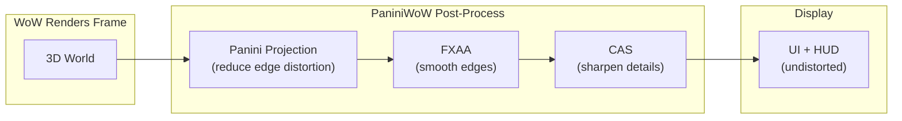

[](https://github.com/mannie-exe/panini-wow/actions/workflows/ci.yml) [](https://github.com/mannie-exe/panini-wow/releases/latest) [](LICENSE)

# Panini Projection

Panini/cylindrical camera projection post-process mod for World of Warcraft Classic (1.12.1) and Wrath of the Lich King (3.3.5a). Based on work by [Jakub Fober](./CREDITS.md#credits).

<details><summary>What?</summary>

Most games use rectilinear perspective projection which looks warped on high resolution displays during high FoV/field-of-view rendering. Panini projection is a method of warping the same image in a way that it appears "unwarped".
</details>

## Screenshots

### Left (Before) and Right (After) — Default Settings


## Features

Applies very little correction for a mild visual effect. Barely noticeable, corrective-only by default.

- Panini projection with configurable strength, vertical compensation, fill zoom, and FoV (0.001 to 3.133 rad)
- FXAA 3.11 anti-aliasing (ps_3_0, single-pass, edge-detect with green-channel luma)
- CAS contrast-adaptive sharpening (detail recovery after FXAA softening)
- Settings dialog with sliders, checkboxes, and live preview; draggable minimap button
- All config is account-wide

## Supported Clients

| Client         | Build |
| -------------- | ----- |
| Classic 1.12.1 | 5875  |
| WotLK 3.3.5a   | 12340 |

Both clients tested on macOS (Apple Silicon via Wine + DXVK). The DLL distinguishes versions by PE header timestamp at load time.

## Getting Started

### Download

Grab the latest release from [Releases](https://github.com/mannie-exe/panini-wow/releases). Each release contains three artifacts: `PaniniWoW.dll` (single DLL for both versions), `PaniniWoW-Classic.zip` (addon for 1.12.1), and `PaniniWoW-WotLK.zip` (addon for 3.3.5a). Each addon zip contains the addon files at the archive root.

### Setup

0. Find your WoW installation, we'll refer to it as `WoW/`
1. Copy `PaniniWoW.dll` to `WoW/mods/`
2. Add `mods/PaniniWoW.dll` to `WoW/dlls.txt`
3. Create or open the matching addon folder:
    - Classic (1.12.1): `WoW/Interface/AddOns/PaniniWoW-Classic/`
    - WotLK (3.3.5a): `WoW/Interface/AddOns/PaniniWoW-WotLK/`
4. Extract the matching addon zip into that folder. WoW does not load addons directly from the zip file; the zip contains the addon's `.toc` and `.lua` files directly, not another nested folder.
5. Requires a `d3d9.dll` loader (DXVK, TurtleSilicon, or vanilla-tweaks)
6. `/reload` or restart WoW

### In-Game

The default values should be fine for most 16:9 aspect ratio displays with high FoV.

Click the minimap button (sweet roll icon) or type `/panini` to open the settings dialog. Use `/panini help` for the full command list, but generally the in-game UI should be fine.

## How It Works



The DLL hooks into WoW's render pipeline between world rendering and UI drawing. Three pixel shaders run in sequence on the rendered frame; the UI draws on top undistorted. All settings are configurable in-game through the addon's settings dialog or slash commands.

### Version Handling

The shader pipeline, projection math, and addon UX are the same on both supported clients. The DLL detects the client version at runtime, selects the matching version-specific offsets and hook plumbing, and then runs the same Panini, FXAA, and CAS post-process chain on the rendered frame.

## Building

Requires MinGW-w64 cross-compiler (`i686-w64-mingw32-g++`), Wine (for shader compilation via vendored fxc2), and [mise](https://mise.jdx.dev/).

```bash
mise install               # install cmake + ninja
mise run build:release     # cross-compile release DLL
mise run build             # cross-compile debug DLL (with debug logging)
mise run test              # run GTest suite via Wine
```

CrossOver is sufficient for builds and normal game use on macOS. Local `mise run test` requires a newer standalone Wine than CrossOver currently provides.

### Shader Compilation

Five HLSL shaders (panini, fxaa, cas, tint, uv_vis) target ps_3_0 and are compiled at build time via a vendored `fxc2.exe` running under Wine. The resulting bytecode headers are embedded in the DLL.

### Wine on macOS with CrossOver

The build tooling already handles the CrossOver case for shader compilation and normal builds. Local test execution is the current exception: `mise run test` requires a newer standalone Wine than CrossOver currently provides.

## Project Structure

```
panini-wow/
  src/                      DLL source (hooks, CVars, state, logging)
  include/                  Headers (panini.h, panini_math.h, log.h, wow_offsets.h)
  shaders/                  HLSL pixel shaders (ps_3_0)
  addon/                    Lua addon packages
    shared/                 Canonical Lua files
    PaniniWoW-Classic/      Classic 1.12.1 (Interface 11200, symlinks to shared/)
    PaniniWoW-WotLK/        WotLK 3.3.5a (Interface 30300, symlinks to shared/)
  cmake/                    Toolchain, shader compilation, version codegen
  tests/                    GTest unit tests (math, config, pipeline)
  tools/fxc2/               Vendored HLSL compiler (d3dcompiler_47.dll)
```

## Commands

| Command                | Purpose                             |
| ---------------------- | ----------------------------------- |
| `/panini`              | Open settings dialog                |
| `/panini toggle`       | Toggle panini on/off                |
| `/panini on\|off`      | Enable/disable panini               |
| `/panini fov N`        | Set FoV (0.001 to 3.133 rad)        |
| `/panini strength N`   | Set projection strength (0 to 0.1)  |
| `/panini vertical N`   | Set vertical compensation (-1 to 1) |
| `/panini fill N`       | Set fill zoom (0 to 1)              |
| `/panini fxaa on\|off` | Toggle FXAA                         |
| `/panini sharpen N`    | Set CAS sharpness (0 to 1)          |
| `/panini reset`        | Reset settings to defaults          |
| `/panini reset ui`     | Reset dialog position to center     |
| `/panini status`       | Show current settings               |
| `/panini cvars`        | Show CVar readback from engine      |

## Troubleshooting

### Log Files

| Log        | Path                     | Contents                                                                                                        |
| ---------- | ------------------------ | --------------------------------------------------------------------------------------------------------------- |
| DLL        | `WoW/mods/PaniniWoW.log` | Init sequence, hook installation, CVar registration, resource creation. Debug builds add per-frame diagnostics. |
| Probe      | `WoW/mods/Probe.log`     | Offset validation, D3D9 device state, camera pointers, CVar readback, loaded modules.                           |
| WoW errors | `WoW/Errors/`            | Crash dumps and stack traces from WoW's error handler.                                                          |
| FrameXML   | `WoW/Logs/FrameXML.log`  | Lua errors during addon loading (when enabled in WoW client).                                                   |

### Diagnostic DLL

If PaniniWoW crashes at startup, build and load `Probe.dll` instead. It validates all memory offsets and reports D3D9 device state without hooking the render pipeline. Add `mods/Probe.dll` to `dlls.txt`, remove `mods/PaniniWoW.dll`, and check `mods/Probe.log` after launching.

```bash
mise run probe     # build probe DLL
```

## Contributing

See [CONTRIBUTING.md](CONTRIBUTING.md) for development workflow and code style guidelines.

## Credits

See [CREDITS.md](CREDITS.md) for acknowledgements of the research, tooling, and community work this project builds upon.

## License

[Apache 2.0](LICENSE)
