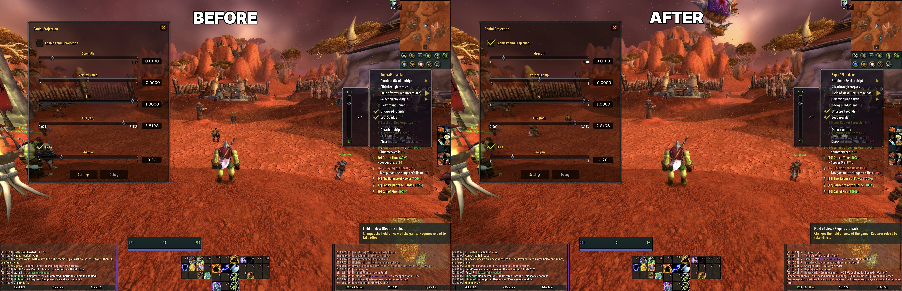
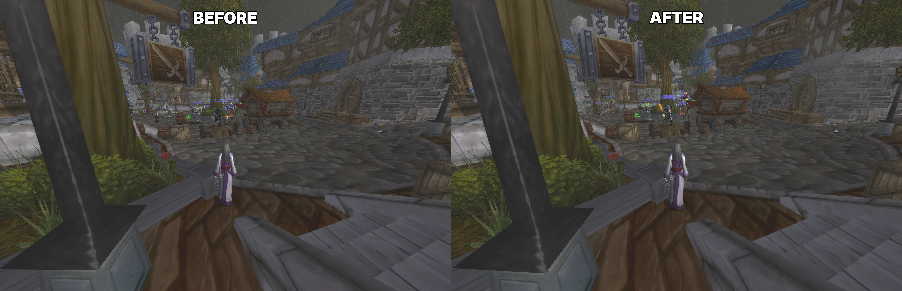
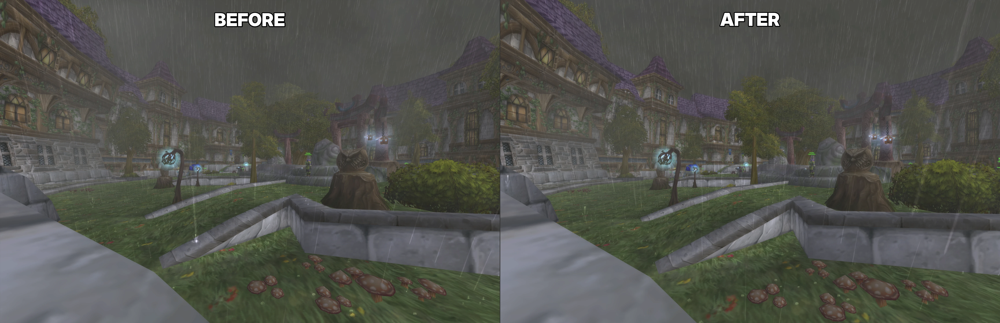
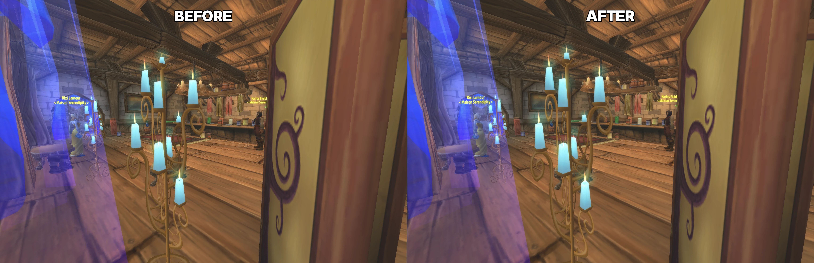
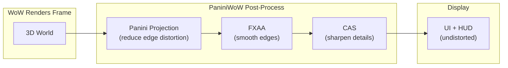

[](https://github.com/mannie-exe/panini-wow/actions/workflows/ci.yml) [](https://github.com/mannie-exe/panini-wow/releases/latest) [](LICENSE)

# Panini Projection

Panini/cylindrical camera projection post-process mod for World of Warcraft Classic 1.12.1 and WotLK 3.3.5a. A single DLL detects the client version at load time and selects the correct memory offsets, hook addresses, and CVar calling conventions. The shader pipeline, projection math, and visual output are identical on both versions. Configurable in-game through a Lua addon with settings dialog and minimap button.

<details><summary>What?</summary>
Perspective projection (what most vintage games use) looks warped on high resolution displays while using high FoV/field-of-view (think 100deg+). Panini projection is a method of warping the same image in a way that it appears "unwarped".
</details>

## Screenshots

Before (left) and after (right) at default settings.






## Features

By default, applies a very small amount of correction to limit effect to a very mild visual enhancement.

- Panini projection with configurable strength, vertical compensation, fill zoom, and FoV (0.001 to 3.133 rad)
- FXAA 3.11 anti-aliasing (ps_3_0, single-pass, edge-detect with green-channel luma)
- CAS contrast-adaptive sharpening (detail recovery after FXAA softening)
- Settings dialog with sliders, checkboxes, and live preview; draggable minimap button
- All config is account-wide

## Supported Clients

| Client         | Build |
| -------------- | ----- |
| Classic 1.12.1 | 5875  |
| WotLK 3.3.5a   | 12340 |

Both clients tested on macOS (Apple Silicon via Wine + DXVK). The DLL distinguishes versions by PE header timestamp at load time.

## Getting Started

### Download

Grab the latest release from [Releases](https://github.com/mannie-exe/panini-wow/releases). Each release contains three artifacts: `PaniniWoW.dll` (single DLL for both versions), `PaniniWoW-Classic.zip` (addon for 1.12.1), and `PaniniWoW-WotLK.zip` (addon for 3.3.5a).

### Setup

0. Find your WoW installation, we'll refer to it as `WoW/`
1. Copy `PaniniWoW.dll` to `WoW/mods/`
2. Add `mods/PaniniWoW.dll` to `WoW/dlls.txt`
3. Copy the matching addon package to `WoW/Interface/AddOns/`:
    - Classic (1.12.1): `PaniniWoW-Classic/`
    - WotLK (3.3.5a): `PaniniWoW-WotLK/`
    - Leave it as ZIP **or** extract to folder of _SAME NAME_
4. Requires a `d3d9.dll` loader (DXVK, TurtleSilicon, or vanilla-tweaks)
5. `/reload` or restart WoW

### In-Game

By default, the configured values should be fine for most 16:9 aspect ratio displays with

Click the minimap button (sweet roll icon) or type `/panini` to open the settings dialog. Use `/panini help` for the full command list, but generally the in-game UI should be fine.

## How It Works



The DLL hooks into WoW's render pipeline between world rendering and UI drawing. Three pixel shaders run in sequence on the rendered frame; the UI draws on top undistorted. All settings are configurable in-game through the addon's settings dialog or slash commands.

### Version-Specific Internals

The shader pipeline, projection math, and visual output are identical on both versions. The DLL's plumbing layer adapts to each client's engine:

| Mechanism        | Classic 1.12.1                                  | WotLK 3.3.5a                                          |
| ---------------- | ----------------------------------------------- | ----------------------------------------------------- |
| CVar system      | `__fastcall` standalone functions               | `__cdecl` wrappers (singleton loaded internally)      |
| CVar value read  | Struct float at fixed offset                    | Struct string at +0x28, parsed via `atof`             |
| RenderWorld hook | `__thiscall` at 0x482D70, chains on SuperWoW    | `__cdecl` callback at 0x4FAF90, standalone trampoline |
| Camera access    | Static pointer chain (WorldFrame +0x65B8)       | `GetActiveCamera()` function call                     |
| Trampoline pool  | Static `.data` section array + `VirtualProtect` | Same                                                  |

## Building

Requires MinGW-w64 cross-compiler (`i686-w64-mingw32-g++`), Wine (for shader compilation via vendored fxc2), and [mise](https://mise.jdx.dev/).

```bash
mise install               # install cmake + ninja
mise run build:release     # cross-compile release DLL
mise run build             # cross-compile debug DLL (with debug logging)
mise run test              # run GTest suite via Wine
```

### Shader Compilation

Five HLSL shaders (panini, fxaa, cas, tint, uv_vis) target ps_3_0 and are compiled at build time via a vendored `fxc2.exe` running under Wine. The resulting bytecode headers are embedded in the DLL.

### Wine on macOS with CrossOver

If the only Wine installation is CrossOver, the build uses `wineloader` (the underlying runtime) instead of the `wine` wrapper, which requires a CrossOver bottle. CMake sets `WINEPREFIX` to the project-local `.wine/` directory automatically.

## Project Structure

```
panini-wow/
  src/                      DLL source (hooks, CVars, state, logging)
  include/                  Headers (panini.h, panini_math.h, log.h, wow_offsets.h)
  shaders/                  HLSL pixel shaders (ps_3_0)
  addon/                    Lua addon packages
    shared/                 Canonical Lua files
    PaniniWoW-Classic/      Classic 1.12.1 (Interface 11200, symlinks to shared/)
    PaniniWoW-WotLK/        WotLK 3.3.5a (Interface 30300, symlinks to shared/)
  cmake/                    Toolchain, shader compilation, version codegen
  tests/                    GTest unit tests (math, config, pipeline)
  tools/fxc2/               Vendored HLSL compiler (d3dcompiler_47.dll)
```

## Commands

| Command                | Purpose                             |
| ---------------------- | ----------------------------------- |
| `/panini`              | Open settings dialog                |
| `/panini toggle`       | Toggle panini on/off                |
| `/panini on\|off`      | Enable/disable panini               |
| `/panini fov N`        | Set FoV (0.001 to 3.133 rad)        |
| `/panini strength N`   | Set projection strength (0 to 0.1)  |
| `/panini vertical N`   | Set vertical compensation (-1 to 1) |
| `/panini fill N`       | Set fill zoom (0 to 1)              |
| `/panini fxaa on\|off` | Toggle FXAA                         |
| `/panini sharpen N`    | Set CAS sharpness (0 to 1)          |
| `/panini reset`        | Reset settings to defaults          |
| `/panini reset ui`     | Reset dialog position to center     |
| `/panini status`       | Show current settings               |
| `/panini cvars`        | Show CVar readback from engine      |

## Troubleshooting

### Log Files

| Log        | Path                     | Contents                                                                                                        |
| ---------- | ------------------------ | --------------------------------------------------------------------------------------------------------------- |
| DLL        | `WoW/mods/PaniniWoW.log` | Init sequence, hook installation, CVar registration, resource creation. Debug builds add per-frame diagnostics. |
| Probe      | `WoW/mods/Probe.log`     | Offset validation, D3D9 device state, camera pointers, CVar readback, loaded modules.                           |
| WoW errors | `WoW/Errors/`            | Crash dumps and stack traces from WoW's error handler.                                                          |
| FrameXML   | `WoW/Logs/FrameXML.log`  | Lua errors during addon loading (when enabled in WoW client).                                                   |

### Diagnostic DLL

If PaniniWoW crashes at startup, build and load `Probe.dll` instead. It validates all memory offsets and reports D3D9 device state without hooking the render pipeline. Add `mods/Probe.dll` to `dlls.txt`, remove `mods/PaniniWoW.dll`, and check `mods/Probe.log` after launching.

```bash
mise run probe     # build probe DLL
```

## Contributing

See [CONTRIBUTING.md](CONTRIBUTING.md) for development workflow and code style guidelines.

## Credits

See [CREDITS.md](CREDITS.md) for acknowledgements of the research, tooling, and community work this project builds upon.

## License

[Apache 2.0](LICENSE)
